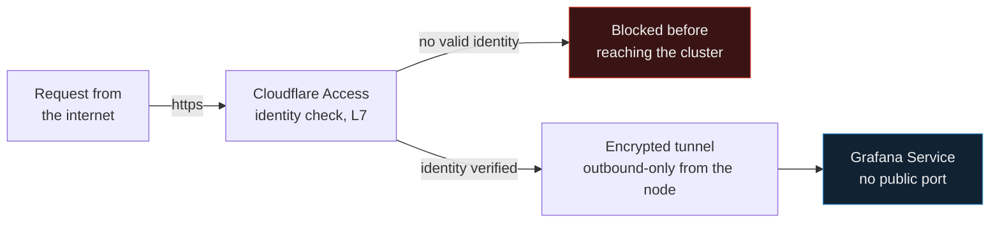
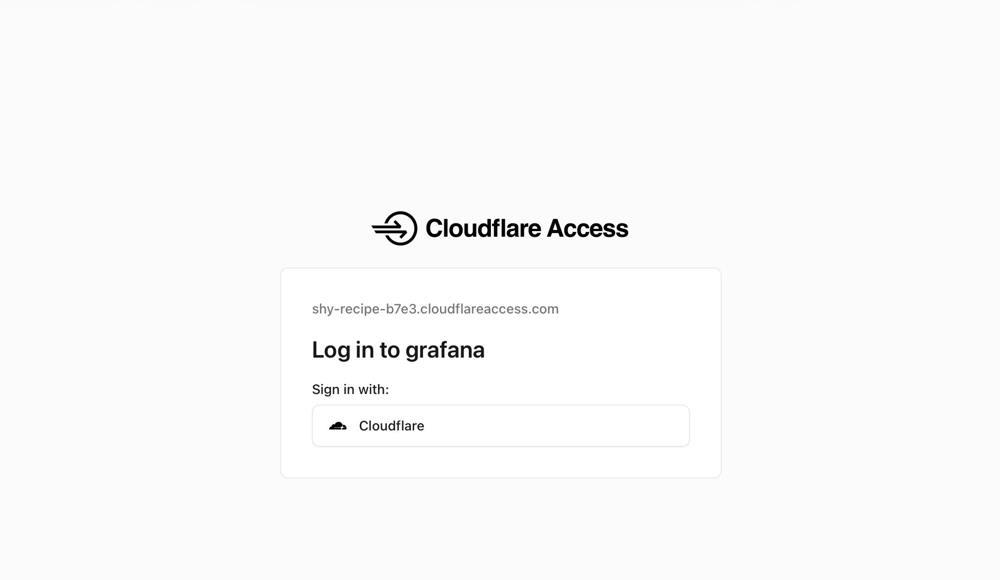
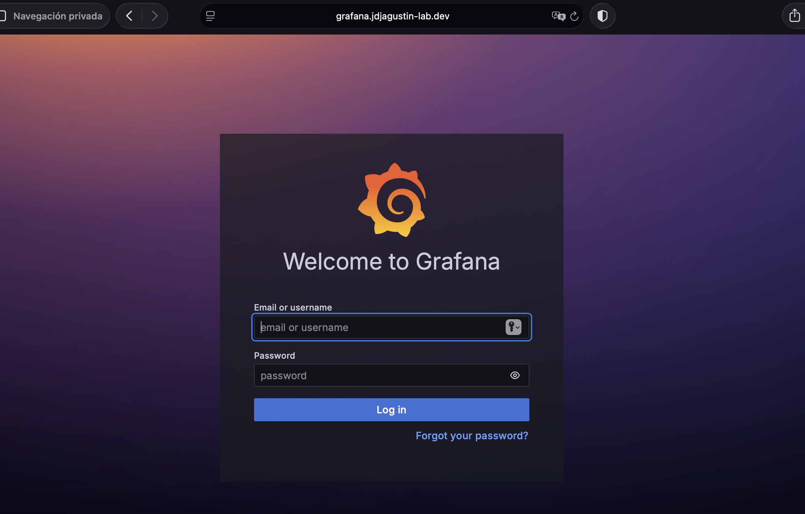
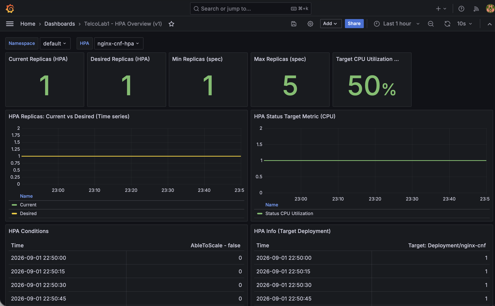

# Zero Trust Network Access on a Self-Hosted 5G/LTE Core Lab

**Cloudflare Tunnel + Access protecting Grafana — zero open inbound ports, identity verified at Layer 7 before every request.**

---

## The problem

This lab runs a full self-hosted 4G/5G core (Open5GS) plus RAN simulation (srsRAN) on Kubernetes, with Grafana, ArgoCD, and other operational tooling sitting behind it. I needed to reach that tooling remotely — without:

- **Opening inbound ports** on the network the cluster lives on. A node with an exposed port is a real attack surface, not a toy concern — it's the same class of risk edge/telco deployments actually face in production.
- **Running a VPN concentrator** as yet another internet-facing service I'd have to patch, monitor, and defend.
- **Substituting network location for identity** — "you're on the LAN/VPN" is not the same claim as "you are who you say you are," and treating them as equivalent is exactly the assumption Zero Trust architecture exists to remove.

That last point is the real reason this is Access + Tunnel and not a VPN. A VPN authenticates once and then grants **network-level (L3) trust** — anyone on that tunnel can reach anything routable behind it, and the VPN endpoint itself is still an inbound listener that has to be exposed and defended. A ZTNA/SASE model authenticates **per application, per request, at L7** — no network-level trust is ever granted, and there's no inbound listener at all, because the connection is initiated *outbound* from inside the network toward the provider's edge. For infrastructure that's deliberately built to mirror telco-grade patterns, that's the architecturally honest comparison — not "which one was faster to set up."



## Why Cloudflare, why the free tier

Access + Tunnel is the same SASE/ZTNA product category used in real enterprise deployments — identity-aware proxying, per-app policies, tunnel-based origin protection that never exposes the origin's real IP or port. The pattern transfers directly to a production context; it isn't a homelab-only trick.

The free tier is a deliberate choice, not a limitation I ran into: this protects a personal lab, not a company's production environment, so there's no reason to pay for SSO connectors or device-posture checks the use case doesn't need yet. The architecture and the validation are identical to the paid tier — if this were gating production infrastructure instead, adding an enterprise IdP or device-posture policy is the next incremental step, not a redesign.

## What's actually protected, and how

| Piece | What it does |
|---|---|
| **Domain** | `jdjagustin-lab.dev`, registered directly through Cloudflare Registrar as a Cloudflare-managed zone. |
| **`cloudflared`** | Runs on the cluster node as a `systemd` service — a persistent outbound connection to Cloudflare's edge, not a foreground process that dies with the terminal. |
| **Tunnel ingress** (`config.yml`) | Maps the public hostname to Grafana's internal service port. That port is never reachable directly — only through the tunnel. |
| **Access policy** | An "Application" bound to the hostname, gated by a policy that allows exactly one identity. Every request, from anyone, anywhere, hits this checkpoint first — there is no path that skips it. |

```yaml
tunnel: 1ec8cef7-31dc-4441-bf12-3e9163265493
credentials-file: /home/jagustin/.cloudflared/1ec8cef7-31dc-4441-bf12-3e9163265493.json

ingress:
  - hostname: grafana.jdjagustin-lab.dev
    service: http://localhost:32000
  - service: http_status:404
```

## Proof, not just config

A policy that looks right on a dashboard isn't the same as one that actually blocks and allows the right traffic. Three tests, from three different angles — the same discipline this whole repo holds to: nothing is "done" until it's validated with real evidence, not just configured.

### 1 — An anonymous request gets challenged, not served

Hitting the hostname without a valid session lands here — not on Grafana:



### 2 — Passing Access doesn't skip the app's own auth either

Access and Grafana are two independent layers with no shared trust shortcut between them:



### 3 — Only then, the real thing

With both layers satisfied: live cluster metrics, not a mockup.



### 4 — Identity doesn't carry across devices or sessions

Repeating the request from a second device on a different network (mobile data, no prior cookies) produced the exact same challenge from zero — no inherited trust, no bypass.

### 5 — There's no back door at the network layer

Bypassing the hostname entirely and hitting the node's real service port directly from outside the network simply times out. Nothing is listening for inbound connections there; the port was never opened. The tunnel is the only path in, and it only forwards what Access has already approved.

*(Login mechanism note, for precision: Access offered "Sign in with Cloudflare" alongside email One-Time-PIN, and that's the flow exercised above — same identity-check principle, different concrete provider. Worth stating exactly, since "I tested X" should mean X.)*

## Why this is one project, not a checkbox

This is Part 1 of a two-layer security architecture over the same lab, not an isolated demo:

- **Part 1 (this doc) — perimeter identity.** Who is allowed to even attempt a connection, enforced before traffic reaches the cluster.
- **Part 2 (in progress) — internal segmentation.** Once traffic is inside the cluster, which pods can talk to which other pods — default-deny `NetworkPolicy` objects in the `open5gs` namespace, explicit NF-to-NF allow rules for the real Open5GS service architecture (AMF↔AUSF, AMF↔SMF, SMF↔UPF via PFCP, and so on). The current CNI (Flannel) doesn't enforce `NetworkPolicy`, so this starts with Calico in policy-only mode. Validated the same way both parts are: a blocked negative case, and a working positive case (real UE registration → 5G-AKA auth → PDU session → traffic) with the policies active — not YAML that merely looks correct.

Together they're the two questions any real Zero Trust architecture has to answer: **who gets in**, and **what can talk to what once they're inside.** This document gets updated when Part 2 lands — not before.

## Reusing this pattern

Nothing here is Grafana-specific. The same Tunnel + Access pair can front any other service in this cluster — ArgoCD, Harbor, the Open5GS WebUI — with zero *additional* inbound attack surface per service added, since the outbound tunnel and the identity layer are already in place. If you're running a homelab (or a small team's internal tools) and want remote access without standing up and maintaining a VPN server, this is a directly copyable pattern: register a zone, install `cloudflared` as a service, point one ingress rule at your internal port, gate it with an Access policy. No inbound firewall rule, ever.

---

*Part of [`telcolab1`](../../README.md) — GitOps-managed K3s lab running Open5GS, MongoDB, and this observability stack.*
