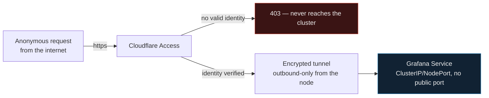

# Zero Trust Network Access on a Home Kubernetes Lab

**Cloudflare Tunnel + Access protecting Grafana — zero open inbound ports, identity-verified before every request.**

---

## Why this exists

This started as a gap check against a real job posting (Senior TAM, Microsegmentation & Zero Trust). I had the conceptual knowledge, but no hands-on evidence of actually building a Zero Trust Network Access (ZTNA) path. So instead of just talking about it, I built one on top of my existing homelab and validated it end-to-end — the same rule I hold for everything in this repo: **nothing gets called "done" until it's tested with real evidence, not just configured.**

## What this is

`grafana.jdjagustin-lab.dev` resolves to the Grafana instance running inside this exact cluster (see the root [README](../../README.md) for the full stack). It is reachable from anywhere on the internet — but **the firewall on the node has no inbound port open for it.** The only thing exposed is an *outbound* connection that the cluster node initiates toward Cloudflare. Nothing can connect in; the tunnel connects out, and Cloudflare Access decides who gets forwarded through it.



No port-forwarding, no VPN, no static public IP, no firewall rule to maintain — and no way in without passing Access first.

## How it's built

| Piece | What it does |
|---|---|
| **Domain** | `jdjagustin-lab.dev`, registered directly through Cloudflare Registrar (at-cost, no markup) as a Cloudflare-managed zone. |
| **`cloudflared`** | Runs on the cluster node as a `systemd` service (not a foreground process — it survives reboots and terminal sessions closing). Holds a persistent outbound connection to Cloudflare's edge. |
| **Tunnel ingress** (`config.yml`) | Maps the public hostname to the internal service — in this case Grafana's NodePort, never exposed directly. |
| **Cloudflare Access** | An "Application" bound to the hostname, gated by a policy that only lets through one identity: mine. Every request, from anyone, anywhere, hits this checkpoint first. |

```yaml
tunnel: 1ec8cef7-31dc-4441-bf12-3e9163265493
credentials-file: /home/jagustin/.cloudflared/1ec8cef7-31dc-4441-bf12-3e9163265493.json

ingress:
  - hostname: grafana.jdjagustin-lab.dev
    service: http://localhost:32000
  - service: http_status:404
```

## Proof, not just config

A policy that looks correct on a dashboard isn't the same as a policy that actually blocks and allows the right traffic. Three tests, from three different angles:

### 1 — An anonymous request gets challenged, not served

Hitting the hostname without a valid session lands here — not on Grafana. This is Access sitting in front of the app, refusing to forward anything until identity is proven:


### 2 — Passing Access doesn't skip the app's own auth either

Access and Grafana are two independent layers. Getting past Access hands you to Grafana's *own* login — there's no shared trust shortcut between them:


### 3 — Only then, the real thing

With both layers satisfied, the actual dashboard — live cluster metrics, not a mockup:


### 4 — Identity doesn't carry across devices or sessions

Repeating the request from a second device on a completely different network (mobile data, no prior cookies) triggered the exact same challenge from zero — no inherited trust, no bypass.

### 5 — There's no back door at the network layer

Bypassing the hostname entirely and hitting the node's real service port directly from outside the network — the one Access normally proxies to — simply times out. There is nothing listening for inbound connections there; the port was never opened. The tunnel is the only path in, and it only forwards what Access approves.

## An honest note on the login method

The plan going in assumed I'd validate this with Access's email One-Time-PIN login. In practice, Access also offered "Sign in with: Cloudflare" (my Cloudflare account itself) as an available identity provider, and that's the flow actually exercised in the tests above. Same principle — identity checked against an explicit policy before any traffic is forwarded — different concrete mechanism. Worth being precise about, since "I tested X" should mean I actually tested X.

## What's next

This is Part 1 of a two-part effort. Part 2 is Kubernetes-native microsegmentation — default-deny `NetworkPolicy` objects inside the `open5gs` namespace, explicit NF-to-NF allow rules, validated the same way (a blocked negative case and a working positive case, not just YAML that looks right). The cluster's current CNI (Flannel) doesn't enforce `NetworkPolicy`, so that starts with installing Calico in policy-only mode. Not started yet — this document will be updated when it is, not before.

---

*Part of [`telcolab1`](../../README.md) — GitOps-managed K3s lab running Open5GS, MongoDB, and this observability stack.*
