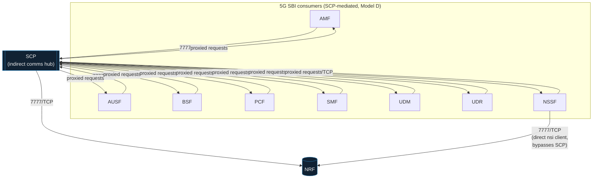

# Internal Segmentation for a Self-Hosted 5G/LTE Core: Default-Deny NetworkPolicy

**25 Kubernetes `NetworkPolicy` objects turning the `open5gs` namespace from "any pod can talk to any pod" into default-deny plus explicit, label-based allow rules — every relationship built from the actual running configuration, not from Open5GS's generic architecture docs, and validated with a blocked negative case and a full live 5G registration as the positive case.**

---

## The problem

Before this, every pod inside the `open5gs` namespace — AMF, SMF, UPF, MongoDB, the WebUI, all of it — could reach every other pod on any port, no restriction at all. That's the default Kubernetes posture: an empty namespace has no network isolation unless something adds it. For a namespace running the full control and user plane of a 4G/5G core, that's a real gap, not a theoretical one: a single compromised or misconfigured pod (a debug sidecar left running, a dependency with a vulnerability, a supply-chain issue in a container image) could reach MongoDB directly, or the SBI interface of any Network Function, with nothing in the way.

This is [Part 2](../cloudflare-zero-trust/README.md#why-this-is-one-project-not-a-checkbox) of a two-layer security architecture over the same lab. Part 1 answered *who gets in* (Cloudflare Access, at the perimeter). This answers the second question any real Zero Trust design has to answer: **once traffic is inside, what can talk to what.**

## Why this isn't "just add a NetworkPolicy"

### The CNI doesn't enforce it: Flannel → Calico

The cluster's CNI was Flannel — a simple VXLAN overlay that provides pod connectivity and nothing else. It does not implement the `NetworkPolicy` API at all; applying a `NetworkPolicy` object on a Flannel-only cluster is a no-op that silently does nothing. Microsegmentation was impossible until the CNI itself changed.

The obvious-looking shortcut — running Calico in "policy-only" mode alongside the existing Flannel, instead of replacing it outright — turned out to be a dead end: it's been broken since Calico v3.26 by an unresolved RBAC bug ([projectcalico/calico#8866](https://github.com/projectcalico/calico/issues/8866)). So this became a full CNI replacement, via the Tigera Operator (v3.32.2), not a partial add-on.

Two decisions worth being explicit about, because they're the kind of detail that separates "it worked on my machine" from something reproducible:

- **VXLAN, not BGP.** Calico defaults to attempting a BGP full-mesh between nodes even when all you need is the same VXLAN encapsulation Flannel was already doing. Left on defaults, `calico-node`'s startup probe hangs forever waiting for BGP peering that will never establish on a two-node lab with no BGP infrastructure. Fixed by explicitly setting `spec.calicoNetwork.bgp: Disabled` on the `Installation` custom resource — encountered live, as a real startup-probe failure, not anticipated in advance.
- **Pod CIDR kept at `10.42.0.0/16`**, matching what Flannel already used — not the `192.168.0.0/16` example range from Calico's own quickstart docs, which would have collided head-on with this lab's real LAN (`192.168.0.20` / `192.168.0.17`, the two nodes' addresses on the actual home network).

k3s needed two server flags to hand the CNI role fully to Calico: `flannel-backend: "none"` and `disable-network-policy: true`, set via `/etc/rancher/k3s/config.yaml` (no such file existed before this — the systemd unit had no extra flags at all).

**Validated, not assumed:** pod count went from 53 to 62 — exactly the 9 new `calico-system`/`tigera-operator` pods, zero pods lost — and both nodes stayed `Ready` throughout. Before writing a single `NetworkPolicy`, the full UERANSIM registration cycle (5G registration → 5G-AKA authentication → PDU session → real ping) was re-run end-to-end on the new CNI, to prove the swap itself hadn't quietly broken anything. It hadn't.

### Mapping what's real, not what's documented

Open5GS has a well-known "generic" architecture (every NF talks to NRF directly, PCF/UDR/HSS touch MongoDB, etc.). Writing NetworkPolicy allow-rules from that generic picture would have been faster — and wrong, more than once, for *this* specific deployment. Instead, every relationship in the final policy set was confirmed by reading the actual `ConfigMap`, `Deployment`, and `Service` objects live in the cluster. That process surfaced several things a documentation-first approach would have missed entirely:

| Assumption | What the real config actually showed |
|---|---|
| All SBI clients discover services only through NRF, or only through SCP | `nssf` has **both** `sbi.client.scp` **and** a direct `sbi.client.nsi` pointing straight at NRF — the only NF besides SCP itself with a direct NRF connection. |
| `observability` (Prometheus) scrapes AMF metrics cross-namespace | Checked all 12 real `ServiceMonitor` objects: **none** target `open5gs`. The `open5gs-amf` Service that a cross-namespace scrape would have used has `0` endpoints — its selector (`app: lab-open5gs-amf`) doesn't match the real AMF pod's labels (`app.kubernetes.io/name: amf`). It's a dead, orphaned Service that never routed anything. A leftover assumption from an earlier session turned out to be false. |
| MongoDB's consumers are declared in their `ConfigMap` | Grepping every `ConfigMap` for `mongodb://` returned **nothing**. `hss`, `pcf`, `udr`, and `webui` all connect via a `DB_URI` environment variable set directly on the `Deployment` — a different layer entirely from where the rest of each NF's config lives. |
| Diameter peers connect in one direction (e.g., MME → HSS, matching typical S6a) | The real `freeDiameter` config for **both** HSS and MME declares a `ConnectPeer` toward the other — same for PCRF ↔ SMF. Rather than guess which side wins the connection race, both directions were allowed. |
| MME → SGW-C → SMF (classic EPC hop-by-hop) | `mme.yaml`'s `gtpc.client` lists **both** `lab-open5gs-sgwc-gtpc` and `lab-open5gs-smf-gtpc` — MME talks GTP-C directly to SMF as well, the combined-core interworking pattern this lab actually runs (SMF/UPF doubling as PGW-C/PGW-U for the 4G side). |

None of these are exotic edge cases — they're exactly the kind of divergence between "how the docs describe it" and "how it's actually wired" that only shows up when you go read the real objects instead of trusting the architecture diagram in your head.

## Architecture: label selectors, not IPs — why it has to be this way

The 5G Core Service-Based Architecture is built around **dynamic discovery**: a Network Function doesn't hardcode who it talks to, it discovers the target through NRF (or, in this deployment, through SCP acting as an indirect-communication proxy per 3GPP's "Model D"). A `NetworkPolicy` written against fixed pod IPs would violate that principle at the network layer even while the application layer stays dynamic — every pod restart, rolling update, or reschedule to a different node changes the pod's IP, and an IP-pinned rule goes stale silently, with no error, no warning, until traffic mysteriously stops flowing.

Every rule in this policy set (with two documented exceptions below) uses `podSelector` matching on `app.kubernetes.io/name`, which Kubernetes re-evaluates continuously against whichever pods are actually alive. If AMF gets rescheduled and comes back with a new IP, the policy re-attaches to it automatically because the label didn't change. This preserves the exact property that makes the SBA work — no NF depends on a fixed address — while still restricting *which NF identities* can reach which other NF identities, which is the real attack surface microsegmentation is meant to shrink: a compromised pod in this namespace can't simply scan the subnet and start talking to whatever it finds, only to the roles its own identity is explicitly allowed to reach.



The two exceptions are `ipBlock` rules for AMF's NGAP port and UPF's GTP-U port, allowing traffic from Cloudlab-1's own host addresses. That's not a design preference, it's a real constraint: UERANSIM (the RAN/UE simulator actually used for validation, see below) runs directly on the lab host, outside the cluster, not as a pod — so there's no pod label to select on for that specific traffic. The in-cluster RAN simulator (`srs-lte`, a separate srsRAN-based deployment) is also allowed by label, for when it's working; it's currently stale and not the one validated in this phase. Both exceptions are called out inline in the policy file itself, precisely so they don't get mistaken for the intended long-term shape of the rule.

## The policy set

Default-deny is one object, applied to the whole namespace, both directions:

```yaml
apiVersion: networking.k8s.io/v1
kind: NetworkPolicy
metadata:
  name: default-deny-all
spec:
  podSelector: {}
  policyTypes:
  - Ingress
  - Egress
```

Everything else is an explicit allow, scoped to one real relationship. As an example, the SCP hub — the busiest single object, since it's both the target of every SBI client's requests and the client proxying those requests onward:

```yaml
apiVersion: networking.k8s.io/v1
kind: NetworkPolicy
metadata:
  name: allow-scp-hub
spec:
  podSelector:
    matchLabels:
      app.kubernetes.io/name: scp
  policyTypes:
  - Ingress
  - Egress
  ingress:
  - from:
    - podSelector:
        matchExpressions:
        - key: app.kubernetes.io/name
          operator: In
          values: [amf, ausf, bsf, pcf, smf, udm, udr, nssf]
    ports:
    - protocol: TCP
      port: 7777
  egress:
  - to:
    - podSelector:
        matchExpressions:
        - key: app.kubernetes.io/name
          operator: In
          values: [amf, ausf, bsf, pcf, smf, udm, udr, nssf, nrf]
    ports:
    - protocol: TCP
      port: 7777
```

The full set — [`charts/open5gs/templates/networkpolicies.yaml`](../../charts/open5gs/templates/networkpolicies.yaml) — groups into six areas, each covering exactly the relationships confirmed in the table above:

| Area | What it covers |
|---|---|
| SBI / SCP hub | The indirect-communication mesh: 8 consumer NFs ↔ SCP, SCP ↔ NRF, plus NSSF's direct NRF exception |
| N2 / N3 (RAN ↔ Core) | AMF's NGAP ingress, UPF's GTP-U ingress, both from the RAN pod and from the validated host-based simulator |
| N4 (control ↔ user plane) | SMF ↔ UPF over PFCP |
| 4G EPC | MME ↔ SGW-C and MME ↔ SMF over GTP-C, SGW-U ↔ SGW-C over PFCP, HSS ↔ MME and PCRF ↔ SMF over Diameter (bidirectional) |
| MongoDB | `hss`, `pcf`, `udr`, `webui`, `mongodb-exporter`, and the one-shot subscriber-seeding Job, all → Mongo on `27017` |
| kubelet health checks | See "gotchas" below — this one wasn't in the original plan |

## Proof: a blocked case and a working 5G registration

Configuration that merely *looks* correct isn't evidence — the same standard Part 1 held to. Two tests, run live on Cloudlab-1 with all 25 policies active.

### Negative case — an unlabeled pod gets nothing

A plain `busybox` pod, dropped into `open5gs` with no matching labels, tried to reach three different core services:

```
$ kubectl -n open5gs exec netpol-test -- nc -zvw3 lab-open5gs-scp-sbi 7777
command terminated with exit code 1

$ kubectl -n open5gs exec netpol-test -- nc -zvw3 lab-open5gs-mongodb 27017
command terminated with exit code 1

$ kubectl -n open5gs exec netpol-test -- nc -zvw3 lab-open5gs-nrf-sbi 7777
command terminated with exit code 1
```

All three blocked. No identity, no access — exactly the point.

### Positive case — a real 5G registration, not a mock

The same UERANSIM-based validation used to confirm the Calico migration didn't break anything was run again with the full policy set active: real 5G-AKA authentication, a real PDU session, real user-plane traffic.

```
[ngap] [info] NG Setup procedure is successful
[nas]  [info] Initial Registration is successful
[nas]  [info] PDU Session establishment is successful PSI[1]
[app]  [info] Connection setup for PDU session[1] is successful, TUN interface[uesimtun0, 10.45.0.3] is up.
```

```
$ sudo ping -I uesimtun0 -c 4 -W 2 8.8.8.8
PING 8.8.8.8 (8.8.8.8) from 10.45.0.3 uesimtun0: 56(84) bytes of data.
64 bytes from 8.8.8.8: icmp_seq=1 ttl=113 time=39.9 ms
64 bytes from 8.8.8.8: icmp_seq=2 ttl=113 time=23.9 ms
64 bytes from 8.8.8.8: icmp_seq=3 ttl=113 time=50.2 ms
64 bytes from 8.8.8.8: icmp_seq=4 ttl=113 time=27.2 ms
--- 8.8.8.8 ping statistics ---
4 packets transmitted, 4 received, 0% packet loss, time 3003ms
```

Same result as the pre-policy baseline run minutes earlier — registration, authentication, PDU session, and real UE-to-internet traffic, all unaffected by the default-deny posture now sitting underneath it. Restart counts across all 20 pods in the namespace were compared before and roughly ten minutes after applying the policies (including the full test above): zero new restarts, zero `Unhealthy` events.

## Real gotchas found along the way

Two things surfaced during this work that weren't part of the original plan, and are worth stating plainly rather than smoothing over:

**kubelet health checks are also subject to NetworkPolicy.** Eleven Network Functions use a `tcpSocket` liveness/readiness probe. That probe traffic comes from the kubelet on whichever node the pod is scheduled on, and it crosses the exact same CNI-enforced boundary as any other connection — a default-deny namespace blocks it just like it would block anything else, unless something explicitly allows it. Missing this would have shown up as pods flipping to `NotReady` or restarting with no application-level problem at all — a subtle, easy-to-miss failure mode. Two additional policies (`allow-kubelet-probes-sbi`, `allow-kubelet-probes-webui`) permit that traffic from both node IPs, confirmed in place *before* it could cause a symptom, not after.

**A stale credential, unrelated to any of this.** Reconstructing the UERANSIM validation (the original commands from roughly a year earlier weren't on hand) surfaced an `AUTN validation MAC mismatch` on the first attempt — a 5G-AKA authentication failure. Root cause: the UE's local config file carried an `OPC` value that no longer matched the subscriber's real record in MongoDB (the `K` value did match). Fixed by updating the local config to the real value from `db.subscribers.findOne(...)` — a stale test fixture, not a symptom of the Calico migration or the NetworkPolicy work, but exactly the kind of thing that only surfaces when you insist on re-running the real end-to-end test instead of trusting that it "should still work."

## Where this leaves the lab

Two things are intentionally out of scope for now, both documented directly as comments in the policy file so they don't get mistaken for oversights:

- **4G RAN traffic into `sgwu` (GTP-U)** isn't allowed yet. There's no active 4G RAN test today — the in-cluster `srs-lte` pod uses a different toolchain (srsRAN over ZeroMQ) and has been stale independent of this work. If the 4G side gets validated later, that rule gets added then, not guessed at now.
- **The `ipBlock` rules for the host-based UERANSIM simulator** are a stand-in for the still-broken in-cluster RAN pod. If `srs-lte` gets fixed, those two rules become candidates for removal.

Together with [Part 1](../cloudflare-zero-trust/README.md), this closes both halves of the Zero Trust question for this lab: Access decides who's allowed to even attempt a connection at the perimeter, and this decides what's allowed to talk to what once traffic is already inside the cluster.

---

*Part of [`telcolab1`](../../README.md) — GitOps-managed K3s lab running Open5GS, MongoDB, and this observability stack.*
