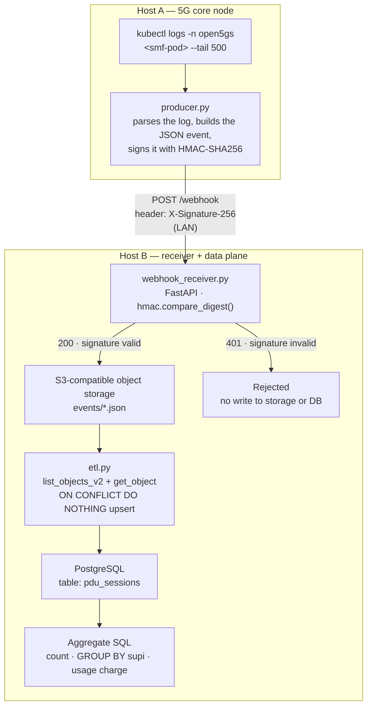

# PDU Session Webhook Pipeline

A signed-webhook receiver and SQL analytics pipeline, driven end-to-end by a real event from a self-hosted 5G core: a live PDU session establishment is read straight out of the network's own logs, packaged as a webhook, signed with HMAC-SHA256, verified with a constant-time comparison, landed in cloud object storage, and loaded through an ETL step into a real relational database where it's queried with aggregate SQL.

The goal isn't a toy webhook demo. It's to build and validate the full chain a production integration actually needs — cryptographic signing, signature verification (including the negative case, which is where most half-built webhook demos stop), idempotent storage, and a data model you can actually query — against a real event source instead of synthetic test data.

## What this demonstrates

- **API/webhook design and consumption**: a FastAPI receiver with a single, well-defined contract (`POST /webhook`, one required header, one JSON body shape).
- **Cryptographic signature verification done correctly**: HMAC-SHA256 over the raw request body, verified with a constant-time comparison, rejecting before any side effect (no storage write, no DB write) on a bad signature.
- **A real ETL step**: object storage → transform/parse → idempotent load into a relational schema.
- **SQL that does something**: not `SELECT *`, but aggregation — counts, group-by, and a derived metric (a simulated usage-based charge) computed from the loaded rows.
- **An event source that isn't synthetic**: the payload is parsed out of real Kubernetes pod logs from a running 5G core, not generated by a script that fabricates realistic-looking JSON.

## Why HMAC-SHA256

This is the same signing primitive Stripe uses to sign its own webhooks — HMAC with SHA-256 computed over the raw payload bytes, verified by recomputing the signature server-side and comparing it against the header using a constant-time comparison function (see [Stripe's webhook signature documentation](https://docs.stripe.com/webhooks/signatures) for the canonical description of the pattern this project follows).

The core primitive is implemented faithfully here: shared-secret HMAC, computed over the *raw* bytes (never the re-serialized/re-parsed JSON, which can silently change key ordering or whitespace and invalidate the signature), compared with `hmac.compare_digest()` instead of `==` so a timing side-channel can't leak how many leading bytes of the signature were correct. What this project does *not* replicate is Stripe's additional replay-protection layer — a timestamp bound into the signed payload, a tolerance window around it, and versioned signature schemes so multiple signing secrets can be rotated in without downtime. That's a natural, well-scoped next step, and it's called out explicitly below rather than left as a silent gap.

## Architecture



Two physical machines on a home lab network, not two containers on one box pretending to be independent services. Host A is a node of a running 5G core (Open5GS on k3s); Host B hosts the receiver and the entire data pipeline. The rejection path is drawn separately on purpose: an invalid signature never reaches the object-storage write or the ETL step, and that separation is verified directly in the [Evidence](#evidence) section below, not just implied by the diagram.

## How it works

**`producer.py`** (Host A) — tails the SMF (Session Management Function) pod's logs with `kubectl logs -n open5gs <smf-pod> --tail 500`, and extracts PDU session establishment lines with a regex matched against the *real* log format (`SUPI[...] DNN[...] IPv4[...]`), not an assumed generic one. For each match it builds a JSON event (an event ID, an ISO-8601 timestamp, a source tag, and the parsed SUPI/DNN/IP fields), serializes it deterministically (`sort_keys=True`, so the same logical event always produces the same bytes and therefore the same signature), and signs those exact bytes with HMAC-SHA256 using a secret shared out-of-band with the receiver:

```python
def sign_payload(payload_bytes: bytes, secret: str) -> str:
    return hmac.new(secret.encode(), payload_bytes, hashlib.sha256).hexdigest()

def send_event(event: dict):
    body = {
        "id": f"evt_{int(time.time() * 1000)}",
        "occurred_at": datetime.now(timezone.utc).isoformat(),
        "source": "open5gs-lab/smf",
        **event,
    }
    payload_bytes = json.dumps(body, sort_keys=True).encode()
    signature = sign_payload(payload_bytes, WEBHOOK_SECRET)
    headers = {"Content-Type": "application/json", "X-Signature-256": signature}
    resp = requests.post(WEBHOOK_URL, data=payload_bytes, headers=headers, timeout=10)
```

A `--negative-test` flag sends a second event with the signature deliberately corrupted (64 zero characters), so every run of the producer exercises both the accept path and the reject path in one shot.

**`webhook_receiver.py`** (Host B) — a single-endpoint FastAPI service. It reads the *raw* request body (not a re-parsed/re-serialized version of it — parsing first and re-signing the parsed object is a common webhook-verification bug, because re-serialization isn't guaranteed to reproduce the exact byte sequence that was signed), recomputes the expected HMAC over those raw bytes, and compares it against the `X-Signature-256` header with `hmac.compare_digest()`:

```python
def verify_signature(payload_bytes: bytes, signature_header: str) -> bool:
    if not signature_header:
        return False
    expected = hmac.new(WEBHOOK_SECRET.encode(), payload_bytes, hashlib.sha256).hexdigest()
    return hmac.compare_digest(expected, signature_header)

@app.post("/webhook")
async def receive_webhook(request: Request):
    payload_bytes = await request.body()
    signature_header = request.headers.get("X-Signature-256", "")
    if not verify_signature(payload_bytes, signature_header):
        raise HTTPException(status_code=401, detail="invalid signature")
    ...
    s3.put_object(Bucket=BUCKET, Key=key, Body=payload_bytes, ContentType="application/json")
    return {"status": "accepted", "s3_key": key, "dynamodb": ENABLE_DYNAMODB}
```

A mismatch returns `401` immediately — before the object-storage client is even called — so a forged event has no path to persistence of any kind. A match writes the raw event to S3-compatible object storage and, optionally, mirrors it into a DynamoDB table in parallel (a NoSQL enrichment path kept separate from, and not a substitute for, the SQL side of this project).

**`etl.py`** (Host B) — lists every object under `events/` in the bucket, reads each one, and upserts it into a `pdu_sessions` table in PostgreSQL using `ON CONFLICT DO NOTHING` on the event ID, so re-running the ETL against the same objects (a re-delivered webhook, a re-run after a crash) never produces duplicate rows. It then runs three queries: a total session count, a per-subscriber aggregation (session count and total MB consumed via `GROUP BY supi`), and a simulated usage-based charge per MB — a deliberate nod to how a real-time charging system prices consumption from exactly this kind of session record:

```sql
-- Per-subscriber aggregation
SELECT supi, count(*) AS sessions, sum(mb_used) AS total_mb
FROM pdu_sessions GROUP BY supi ORDER BY sessions DESC;

-- Simulated usage-based charge
SELECT supi, sum(mb_used) AS total_mb,
       round(sum(mb_used) * 0.05, 2) AS simulated_charge_usd
FROM pdu_sessions GROUP BY supi ORDER BY total_mb DESC;
```

**`rds_setup.sh`** (Host B) — provisions the PostgreSQL instance through a real RDS-style API (`create-db-instance`, then polling until the instance reports `available`) against a local AWS-compatible cloud emulator, and prints the real endpoint (host + port of the underlying Postgres container) that `etl.py` and `psql` connect to. The database itself is a genuine PostgreSQL instance — not a mock, not an in-memory stand-in — so the lifecycle (provision, wait for availability, connect, create schema, query) matches what the same steps would look like against an actual managed database.

**`log_session.sh`** — wraps the terminal in Linux's `script` command to capture a literal, timestamped transcript of everything typed and everything printed during a working session, tagged with the operator and hostname. Useful as a raw, unedited record of exactly what was run and in what order, independent of whatever gets written up afterward.

## Terminology

| Term | Category | What it means here |
|---|---|---|
| **HMAC** | Security | Hash-based Message Authentication Code — a cryptographic signature computed with a shared secret key. Changing a single byte of the payload invalidates the signature. The same mechanism Stripe uses to sign its own webhooks. |
| **Webhook** | API | An HTTP callback: instead of polling for state, the system POSTs to you the moment an event happens. |
| **ETL** | Data | Extract, Transform, Load — pulling data from a source (object storage), shaping it, and loading it into its destination (a relational database). |
| **S3** | Cloud | AWS's object storage service. Here it holds each raw event as a JSON file. |
| **RDS** | Cloud | AWS's managed relational database service. The local emulator backs it with a real PostgreSQL instance running in a container. |
| **SUPI** | 5G Core | Subscription Permanent Identifier — the subscriber's permanent identifier in 5G (e.g. `imsi-999700000000001`). |
| **DNN** | 5G Core | Data Network Name — which data network a session connects to (5G's equivalent of the older "APN"). |
| **PDU Session** | 5G Core | Protocol Data Unit Session — the data session a device establishes to send/receive traffic. The real business event that triggers this whole pipeline. |
| **SMF** | 5G Core | Session Management Function — the 5G core network function that manages and logs PDU sessions; the source of the real event used here. |
| **PFCP** | 5G Core | Packet Forwarding Control Protocol — the control-plane channel between SMF and UPF, visible as background noise in the same logs (not itself part of the parsed event). |
| **FastAPI / uvicorn** | Backend | FastAPI is the Python framework the receiver's API is built with; uvicorn is the ASGI server that runs it and listens on the service port. |
| **boto3** | Backend | The official AWS SDK for Python — how the producer, receiver, and ETL step talk to the S3/RDS emulator using real AWS API calls. |
| **`compare_digest()`** | Security | A constant-time string comparison, so an attacker can't infer the correct signature by measuring how long a mismatched comparison takes (a timing side-channel). |

## Evidence

**Scenario 1 — real event, valid signature:**

```
$ python3 producer.py --negative-test
2 event(s) found. Sending the first one (real case, valid signature)...
POST http://<receiver-host>:8000/webhook (valid signature) -> 200 {"status":"accepted","s3_key":"events/evt_1788825995441.json","dynamodb":false}
```

**Scenario 2 — signature deliberately corrupted:**

```
Sending NEGATIVE case (signature deliberately invalid)...
POST http://<receiver-host>:8000/webhook (invalid signature) -> 401 {"detail":"invalid signature"}
```

**Scenario 3 — confirming object storage only holds the valid event:**

```
$ aws --endpoint-url=http://localhost:4566 s3 ls s3://<bucket>/events/
2026-XX-XX 18:06:35        221 evt_1788825995441.json   # only the valid event — the rejected one is absent
```

**Scenario 4 — confirming the database only holds the valid event:**

```
$ psql "$PG_DSN" -c "SELECT id FROM pdu_sessions;"
        id
-------------------
 evt_1788825995441
(1 row)
```

**Scenario 5 — aggregate SQL against the loaded data:**

```
$ python3 etl.py
1 event(s) found in s3://<bucket>/events/
Total sessions loaded: 1
Per-UE aggregation (SUPI):
  ('imsi-999700000000001', 1, Decimal('172.03'))
Simulated usage charge ($0.05 USD/MB example rate):
  ('imsi-999700000000001', Decimal('172.03'), Decimal('8.60'))
```

**Same two cases, reproduced manually with `curl`** — independent of the Python client, to confirm the HTTP-level contract holds on its own, with no client-side logic hidden in the way the request is built:

```bash
# Valid signature -> 200
curl -i -X POST http://localhost:8000/webhook \
  -H "Content-Type: application/json" \
  -H "X-Signature-256: $(cat sig.txt)" \
  --data-binary @payload.json
# HTTP/1.1 200 OK
# {"status":"accepted","s3_key":"events/evt_curl_test_1.json","dynamodb":false}

# Corrupted signature (64 zeros) -> 401
curl -i -X POST http://localhost:8000/webhook \
  -H "Content-Type: application/json" \
  -H "X-Signature-256: $(printf '0%.0s' {1..64})" \
  --data-binary @payload.json
# HTTP/1.1 401 Unauthorized
# {"detail":"invalid signature"}
```

Why the negative case matters as much as the positive one: a webhook receiver that only ever exercises the happy path proves nothing about its security properties. Every validation run here deliberately includes a forged-signature attempt, and confirms — by directly querying storage and the database, not by trusting the HTTP status code alone — that the forged event has no path to persistence anywhere in the system.

## Troubleshooting notes

None of this worked on the first try, and keeping that honest is more useful than presenting a clean-looking happy path:

- **File transfer between hosts** — the initial approach (drag-and-drop through a remote-desktop session) only supports single loose files, not folders. Fixed by enabling SSH on both machines and transferring with `scp`.
- **Local cloud emulator not responding** — the object-storage/RDS emulator container had stopped after a host restart. A one-line `start` command brought all of its services back up, including the RDS-compatible service backing PostgreSQL.
- **Missing Python tooling** — `python3-venv` and `pip` weren't installed on either host. Installed both before creating virtual environments.
- **Regex mismatch in the log parser** — the parser initially assumed a generic Open5GS log format (`APN[...]`, `IP[...]`); the real logs use `DNN[...]` and `IPv4[...]`. Fixed by inspecting the raw log output first, instead of coding against an assumed format.
- **`NoCredentialsError` from boto3** — the AWS SDK requires credentials to be present even against a local emulator that doesn't actually validate them. Fixed by exporting dummy `AWS_ACCESS_KEY_ID` / `AWS_SECRET_ACCESS_KEY` values before starting any boto3-dependent process.
- **Bucket didn't survive a container restart** — the emulator's storage is ephemeral by default. Recreated the bucket in seconds with a single `s3 mb` command.

## What's next

- **Run the receiver inside a real container/VM instance on the local cloud emulator** (via its EC2-compatible API — user-data, an instance metadata endpoint — rather than as a bare background process) — closer to how this would actually be deployed.
- **Land the raw event in a NoSQL store in parallel to the relational database**, purely as an enrichment exercise — the S3 → ETL → PostgreSQL path above is the one that matters for the core use case; DynamoDB mirroring is optional and doesn't replace it.
- **Add Stripe-style replay protection**: bind a timestamp into the signed payload, reject requests outside a tolerance window, and support multiple concurrently valid signing secrets (a versioned signature scheme) so a secret can be rotated without downtime — on top of the signature check that already exists.

## Stack

Python · FastAPI · `hmac` / `hashlib` (stdlib) · boto3 · PostgreSQL · `psycopg2` · a local AWS-compatible cloud emulator (S3 + RDS) · Kubernetes (Open5GS 5G core as the real event source) · curl
